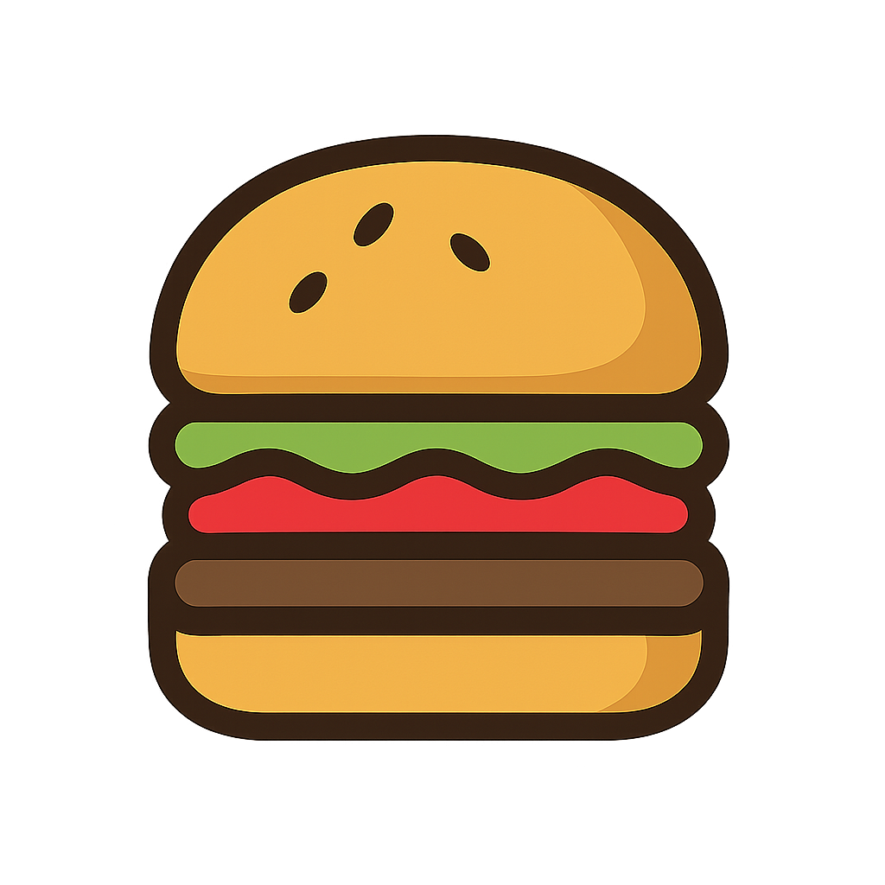

# 🍔 BurgerBite

<div align="center">
  
  

  <h3>A modern, responsive burger delivery web application built with React</h3>

  [](https://reactjs.org/)
  [](https://vitejs.dev/)
  [](https://getbootstrap.com/)
  [](https://tailwindcss.com/)
  
</div>

## ✨ Features

- 🎯 **Responsive Design** - Works flawlessly across desktop, tablet, and mobile devices
- 🔍 **Intuitive Menu** - Filter food items by categories to find your favorite burger
- 🛒 **Shopping Cart** - Add items, view cart, and checkout seamlessly
- 🔐 **User Authentication** - Simple login/registration system 
- 💳 **Secure Payment** - Integrated payment options (demo)
- 🚚 **Delivery Tracking** - Track your order in real-time

## 📱 Screenshots

<div align="center">
  

  <p>
    
    
  </p>
</div>

> Note: Add your own screenshots to the `screenshots` folder after deploying the app

## 🛠️ Tech Stack

- **Frontend**: React, React Router, Bootstrap, Tailwind CSS
- **State Management**: React Context API
- **Styling**: CSS, Bootstrap, Tailwind CSS
- **Build Tool**: Vite
- **Icons**: Bootstrap Icons

## 📦 Project Structure

```
BurgerBite/
├── public/              # Static files
├── src/
│   ├── assets/          # Images, videos, and other media
│   ├── components/      # Reusable components
│   ├── pages/           # Page components
│   ├── styles/          # CSS and style files
│   ├── App.jsx          # Main app component
│   └── main.jsx         # Entry point
├── index.html           # HTML template
└── package.json         # Dependencies and scripts
```

## 🚀 Getting Started

### Prerequisites

- Node.js (v14 or higher)
- npm or yarn

### Installation

1. Clone the repository:
   ```bash
   git clone https://github.com/yourusername/BurgerBite.git
   cd BurgerBite
   ```

2. Install dependencies:
   ```bash
   npm install
   # or
   yarn install
   ```

3. Start the development server:
   ```bash
   npm run dev
   # or
   yarn dev
   ```

4. Open your browser and navigate to:
   ```
   http://localhost:5173
   ```

## 🌐 Deployment

To build the app for production:

```bash
npm run build
# or
yarn build
```

This will create a `dist` folder with all the optimized files ready for deployment.

## 🧩 Key Components

- **Home**: Showcases featured burgers, promotions, and restaurant information
- **Menu**: Displays all available food items with filtering capabilities
- **About**: Shares the restaurant's story and values
- **Services**: Highlights the services offered
- **Login/Register**: User authentication pages
- **Cart**: Shopping cart with checkout process

## 🛣️ Roadmap

- [ ] Implement user profile management
- [ ] Add burger customization options
- [ ] Integrate online payment gateways
- [ ] Develop admin dashboard
- [ ] Add dark mode

## 🤝 Contributing

Contributions are welcome! To contribute:

1. Fork the repository
2. Create a feature branch: `git checkout -b feature/amazing-feature`
3. Commit your changes: `git commit -m 'Add some amazing feature'`
4. Push to the branch: `git push origin feature/amazing-feature`
5. Open a Pull Request

## 📄 License

This project is licensed under the MIT License - see the [LICENSE](LICENSE) file for details.

## 📞 Contact

- Website: [yourdomain.com](https://yourdomain.com)
- Email: your.email@example.com
- Twitter: [@yourtwitterhandle](https://twitter.com/yourtwitterhandle)

---

<div align="center">
  Made with ❤️ by Your Name
  
  ⭐ Star this project if you find it useful!
</div>
